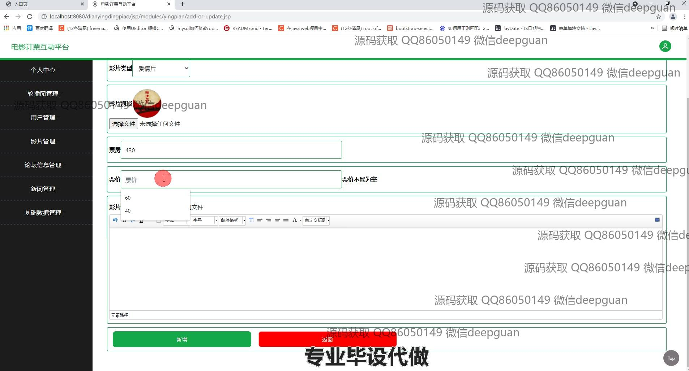
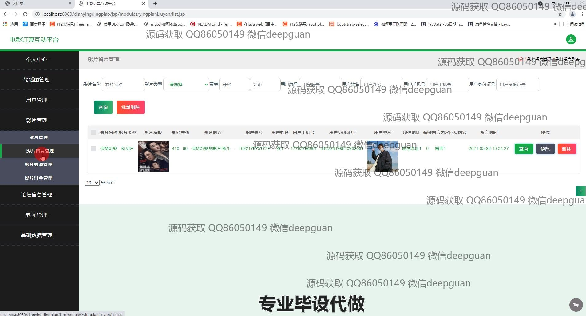
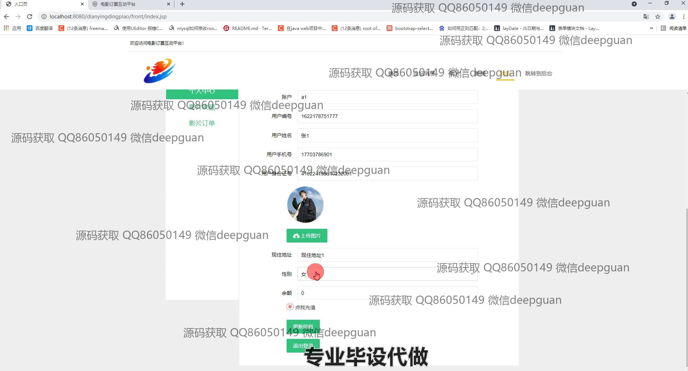

<h1 align="center">基于的电影订票互动系统的设计与实现</h1>

## 简介
电影订票互动系统：角色分为管理员、用户；主要功能包括用户信息管理、影片管理和查询、新闻管理、论坛信息互动、个人中心功能，提供便捷的在线购票和用户参与体验。    --计算机毕业设计源码；毕设源码；java毕业设计源码

## 联系方式

<h3 align="center">获取完整代码与数据库文件 + 微信：deepguan QQ: 86050149 QQ群: 783742310</h3>

<h3 align="center">可帮忙远程部署 包运行成功！提供远程部署、修改代码、设计文档指导、代码讲解等服务！</h3>

## 功能介绍（完整见运行截图）
管理员：管理员可以通过后台系统管理所有影片和新闻内容，包括新增、修改和删除影片及新闻信息。管理员界面提供了用户管理功能，支持编辑用户信息、重置密码、审查用户留言和论坛帖子。影片管理模块允许添加票房和票价信息，并提供影片筛选和类型管理。导航菜单简化了系统模块间的切换，如个人中心、轮播图和基础数据管理。

用户：用户可以注册或登录系统，查看和编辑个人信息，包括上传头像和更新联系方式。网站首页显示推荐影片和新闻，用户可浏览电影详情，进行收藏或立即购票。系统提供论坛和新闻板块，用户可以发布帖子或评论，与他人交流互动。用户中心汇总了订单和收藏内容，支持查看或修改已有的购买记录和兴趣清单。

## 运行截图

本代码来源于网络,仅供学习参考使用!

